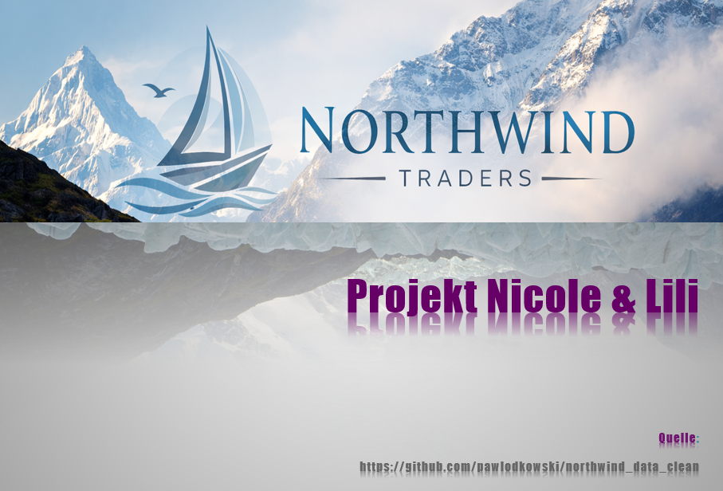
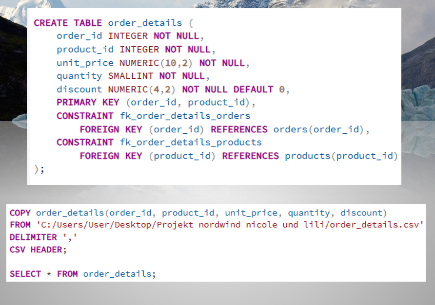
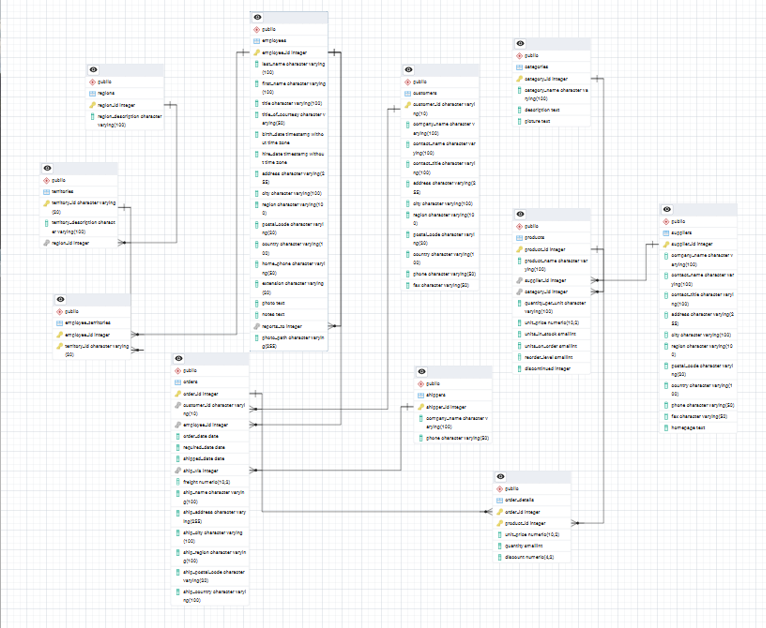

# 📊 Northwind Datenbank Projekt

**PostgreSQL | DBeaver**  
Projekt von *Nicole & Lili*

---

## 🧾 Projektbeschreibung

In diesem Projekt wurde die Northwind-Datenbank vollständig neu aufgebaut.  
Die Tabellen wurden erstellt, miteinander verknüpft und mit CSV-Daten befüllt.

Ziel war die Analyse von:
- Verkäufen
- Kunden
- Produkten
- Lagerbeständen
- Umsätzen

---

## 🖼️ Projekt Einblicke

### Datenbank & Struktur

### Tabellen & Beziehungen

### SQL Abfragen & Ergebnisse

### Analyse / Auswertung

---

## 🗂️ Verwendete Tabellen

- categories  
- customers  
- employees  
- regions  
- shippers  
- suppliers  
- territories  
- products  
- orders  
- employee_territories  
- order_details  

---

## 🔍 Wichtige Analysen

- meistverkaufte Produkte  
- teuerste & günstigste Produkte  
- Umsatz pro Kunde  
- Lagerbestand vs. Nachfrage  
- erfolgreichster Verkäufer  
- Entwicklung 1996–1998  

---

## ⚙️ Verwendete SQL-Techniken

- JOINs
- GROUP BY
- Aggregatfunktionen (SUM, AVG, COUNT)
- Subqueries
- Views
- Funktionen
- Trigger
- CSV Import mit COPY

---

## 🚀 Besondere Features

✔ Funktion zur Berechnung des Bestellwerts  
✔ Trigger zur automatischen Lagerreduzierung  
✔ Eigene Views für bessere Übersicht  

---

## 📈 Fazit

Das Projekt zeigt deutlich:

- Unterschiede zwischen günstigen und teuren Produkten  
- wichtige Kunden und Umsatztreiber  
- Nachfrageverhalten und Lagerprobleme  
- Entwicklung des Unternehmens über mehrere Jahre  

---

## 👩‍💻 Projektteam

**Nicole & Lili**
